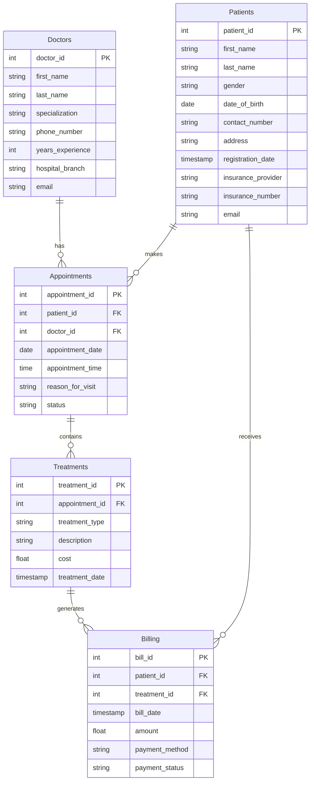

````markdown
# SDSC5003 Hospital Management System

This repository contains the source code for a simple Hospital Management System developed as a group project for **SDSC5003 – Storing and Retrieving Data** at City University of Hong Kong (Dongguan).

The goal of the project is to design and implement a small relational database application with a web-based interface to manage core entities in a hospital, including **Doctors, Patients, Appointments, Treatments, and Billing**.

---

## Project Structure

The repository is organised into the following main folders:

```text
SDSC-5003-Hospital-Management-System/
├── backend/        # Python backend (Flask) that exposes REST APIs and talks to the database
├── frontend/       # HTML/CSS/JavaScript pages for user interaction
├── dataset/        # CSV / SQL files used to populate the database
├── .gitignore
├── app.py          # Flask Main Application Entry
└── README.md
````

High-level description:

* `backend/`

  * Contains the Python server code (e.g. `db.py`) that defines the REST API for managing doctors, patients, appointments, treatments and billing records.
  * Handles all database connections and SQL queries against the underlying SQLite database.

* `frontend/`

  * Contains static HTML, CSS and JavaScript files.
  * Sends HTTP requests to the backend API to display and update information about doctors, patients, appointments, etc.

* `dataset/`

  * Contains sample data files (e.g. CSV / SQL scripts) that can be used to initialise or populate the database for testing and demonstration.

---

## Dependencies

### Backend

The backend is implemented in **Python** using **Flask** and SQLite.

Minimum requirements:

* Python 3.9+
* The following Python packages (installable via `pip`):

  * `flask`
  * (plus any additional packages imported in `backend/patient.py`, such as `flask_cors` or others)

The database layer uses **SQLite**, accessed through Python’s standard library (`sqlite3`).

### Frontend

The frontend consists of static files and runs in any modern web browser:

* HTML / CSS / JavaScript
* No extra build tools (such as Node.js) are strictly required if you open the pages directly in the browser or serve them via a simple static HTTP server.

---

## How to Run the Project

Below is a typical way to run the system locally on your machine.

### 1. Clone the repository

```bash
git clone https://github.com/lepufeng/SDSC-5003-Hospital-Management-System.git
cd SDSC-5003-Hospital-Management-System
```

### 2. (Optional but recommended) Create and activate a virtual environment

```bash
python -m venv venv
# Windows
venv\Scripts\activate
# macOS / Linux
source venv/bin/activate
```

### 3. Install backend dependencies

If you do not maintain a `requirements.txt`, you can install the core package directly:

```bash
pip install flask
# plus any other packages imported in backend/app.py
```

(If later you add a `requirements.txt` under `backend/`, you can replace the above with
`pip install -r backend/requirements.txt`.)

### 4. Prepare the database

The backend uses an SQLite database (for example, a file such as `hospital.db`).
The exact path and file name are configured inside the backend code (e.g. a file such as `backend/db.py`).

Typical options:

* **Option A:** The backend creates the tables automatically when it first runs.
* **Option B:** Run a helper script (for example, an initialisation script in `backend/`) that:

  * Creates the tables; and
  * Loads sample data from the `dataset/` folder (doctors, patients, appointments, etc.).

Please check the comments in the backend code (`backend/app.py` and any `db` or `init` script) for the exact initialisation step used by your group.

### 5. Run the backend server

From the project root (or inside `backend/`):

```bash
cd backend
python app.py
```

By default, a Flask app typically runs at:

* `http://127.0.0.1:5000/`

If your code uses a different port or host, please adjust accordingly.

### 6. Run / open the frontend

**Option 1 – Open directly**

* Open the main HTML page (for example, `frontend/index.html`) in your browser.
* Make sure the backend server is already running so that the frontend can call the API.

**Option 2 – Serve via a simple HTTP server** (recommended for some browsers):

```bash
cd frontend
python -m http.server 8000
```

Then open:

* `http://127.0.0.1:8000/` in your browser.

The JavaScript code in the frontend sends HTTP requests to the backend API (usually at `http://127.0.0.1:5000`).
If your API runs on a different address, update the base URL in the frontend JavaScript file where the API endpoints are defined.

---

## Database Design (ER Diagram)

The main entities and relationships in the database are:



This ER diagram summarises the data model that the backend uses to implement the hospital management features.

---

## Notes

* This project is for educational purposes as part of SDSC5003.
* The code is intentionally kept simple to highlight **database design**, **basic web API implementation**, and **simple frontend–backend interaction**, rather than production-level security or deployment.

```
::contentReference[oaicite:0]{index=0}
```
